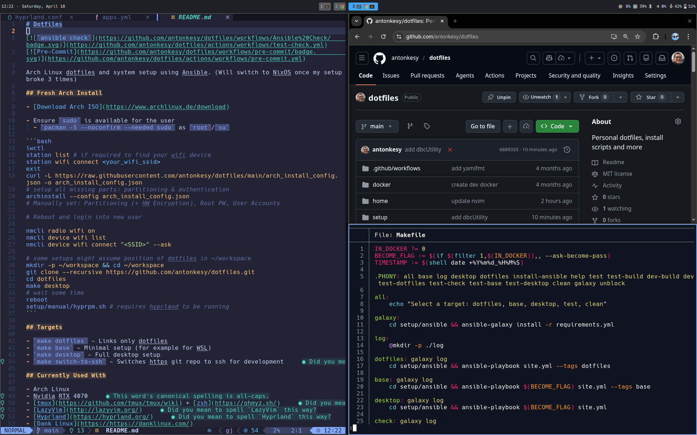

# Dotfiles

[](https://github.com/antonkesy/dotfiles/actions/workflows/nix.yml)
[](https://github.com/antonkesy/dotfiles/actions/workflows/pre-commit.yml)

NixOS system and Home Manager configuration. (Previously Arch Linux + Ansible —
the setup did break three times, as predicted.)



## Try it without installing anything

```bash
make demo
```

Builds the `demo` host into a QEMU image and boots it: Hyprland + DankMaterialShell,
autologin as `ak` / `demo`. Needs `nix` with flakes and KVM — **not** `nixos-rebuild`.
`Ctrl-Alt-G` releases the mouse. `make demo-clean` throws the disk away.

The demo runs the **same module set as `akdesk`** — same apps, same language
toolchains, same nvim config, same shell — minus the two things a VM has no
hardware for: `nvidia.nix` and VirtualBox. First run pulls the full closure
(~10 GiB download, ~30 GiB in the store); after that it starts in seconds.

It renders with llvmpipe, not virgl: `-display gtk,gl=on` needs qemu's GTK to
obtain a host GL context, which fails on many hosts with `GtkGLArea console
lacks DMABUF support`. On a host where virgl does work, opt back in with
`QEMU_OPTS="-display gtk,gl=on" make demo`.

## Hosts

| host | what it is |
|---|---|
| `akdesk` | desktop workstation — NVIDIA RTX 4070, CUDA, VirtualBox, dual-boot with Windows |
| `aklap` | Dell laptop — same config as `akdesk`, plus fingerprint reader and power management, minus VirtualBox |
| `demo` | throwaway QEMU VM for `make demo` |

## Fresh install

From an empty machine to a working desktop. `akdesk` and `aklap` install exactly
the same way — the host name is the only substitution, so pick it once:

```bash
HOST=akdesk   # or aklap
```

### 1. Write the ISO to a USB stick

On any machine that already works. Take the **minimal** ISO — the graphical
installer boots nouveau and none of it is used here anyway.

- [Download the NixOS ISO](https://nixos.org/download/#nixos-iso)

```bash
lsblk                                  # find the stick, and be sure about it
sudo dd if=nixos-minimal-*.iso of=/dev/sdX bs=4M status=progress conv=fsync
```

### 2. Boot it

Firmware in UEFI mode, Secure Boot **off** — the NVIDIA kernel modules are
unsigned and will not load otherwise.

### 3. Get online

Ethernet needs nothing. For wifi:

```bash
sudo systemctl start wpa_supplicant
wpa_cli   # add_network / set_network 0 ssid "..." / set_network 0 psk "..." / enable_network 0
```

### 4. Clone the repo

Anywhere in the live session — the target disk does not exist yet. The
permanent checkout comes later (step 8), and its path is load-bearing:
`modules/home/nvim.nix` symlinks `~/.config/nvim` into
`~/Projects/dotfiles/home/.config/nvim` so lazy.nvim can write lock files
into a real checkout.

```bash
git clone --recursive https://github.com/antonkesy/dotfiles.git
cd dotfiles
```

### 5. Generate the hardware config

Kernel modules and CPU only — `hosts/disk.nix` declares the filesystems, so
`--no-filesystems` is what keeps the two from fighting:

```bash
sudo nixos-generate-config --no-filesystems --show-hardware-config \
  > hosts/$HOST/hardware-configuration.nix
```

Overwriting works because that file is already tracked by git. Anything *new*
you add needs `git add` before the flake can see it — flakes ignore untracked
files in a git tree, which is the classic first-install "my change did nothing".

### 6. Install

One command: partition, format, mount, install. `--disk main` overrides the
device in `hosts/disk.nix`, and **erases it**.

```bash
lsblk                                  # pick the target disk — this erases it

sudo nix --experimental-features "nix-command flakes" run github:nix-community/disko#disko-install -- \
  --flake .#$HOST --disk main /dev/nvme0n1
```

The layout lives in [`hosts/disk.nix`](hosts/disk.nix): 1 GiB ESP, 16 GiB swap,
ext4 root over the rest. Edit it there rather than partitioning by hand — for
LUKS, wrap the root partition's content in disko's `luks` type; nothing else in
the repo cares. Pulls a big closure on first run.

On `akdesk` (dual-boot) point `--disk main` at the **second** disk — disko
wipes whatever it is given, including a Windows ESP.
`boot.loader.grub.useOSProber` (`modules/nixos/base.nix`) finds Windows from
the new ESP.

### 7. Set a password for `ak`

Nothing in the repo declares one outside the demo host, and `disko-install`
leaves root locked, so skipping this leaves you unable to log in. It also
unmounts on the way out, hence the remount:

```bash
sudo nix --experimental-features "nix-command flakes" run github:nix-community/disko -- \
  --mode mount --flake .#$HOST
sudo nixos-enter --root /mnt -- passwd ak
```

### 8. Reboot

```bash
reboot
```

Pull the stick.

### 9. After first boot

```bash
mkdir -p ~/Projects && cd ~/Projects
git clone --recursive https://github.com/antonkesy/dotfiles.git
nmtui                                # wifi, via NetworkManager
cd dotfiles && make switch
```

If `make switch` rebuilds cleanly, that is the whole workflow from here on. Log
in through the GNOME session once if you want Gnome Online Accounts (see
[Workarounds](#gnome-online-accounts-on-hyprland)), and swap the remotes to SSH
once your keys are in place.

## Targets

| target | what it does |
|---|---|
| `make switch` | build + activate for the current hostname |
| `make boot` | activate on next boot |
| `make build` | build without activating |
| `make check` | evaluate and build every host |
| `make update` | update flake inputs |
| `make fmt` | format all nix files |
| `make demo` | boot the desktop config in QEMU |

## Layout

```
flake.nix          inputs and the three nixosConfigurations
lib/mkHost.nix     nixosSystem wrapper, wires in Home Manager
hosts/             per-machine config + hardware-configuration.nix
hosts/disk.nix     disko partition layout for the physical hosts
modules/nixos/     system modules (base, desktop, apps, development, ...)
modules/home/      Home Manager modules (zsh, tmux, terminal, hyprland, nvim, git)
pkgs/              derivations for what is not in nixpkgs
home/              raw dotfile content consumed by modules/home/
```

## Currently used with

- NixOS (unstable)
- NVIDIA RTX 4070
- [tmux](https://github.com/tmux/tmux/wiki) + zsh + [powerlevel10k](https://github.com/romkatv/powerlevel10k)
- [LazyVim](http://lazyvim.org/)
- [Hyprland](https://hyprland.org/) (Lua config, 0.55+)
- [DankMaterialShell](https://danklinux.com/)

## What changed from the Ansible setup

Things that used to be imperative and are now declarative, or simply gone:

- `yay`/`paru`/`makepkg` and the hand-rolled `aur_build` role — everything is a nixpkgs
  attribute or a derivation in `pkgs/`
- `ghcup`, `opam init`, SDKMAN, `pipx`, `cargo install`, `go install ...@latest`,
  `luarocks install` as root — all pinned toolchains now
- neovim and flutter built from source into `/usr/local` and `setup/build/`
- `stow --adopt`, which moved files *into* the repo — Home Manager symlinks out of it
- znap and zinit, which `git clone`d themselves on every shell start —
  `programs.zsh.plugins`
- TPM and `~/.tmux/plugins` — `programs.tmux.plugins` writes store paths directly
- a hand-written `/etc/systemd/system/ollama.service` (that never created the `ollama`
  user), `nvidia-ctk runtime configure`, and `lineinfile` edits to `/etc/pam.d/*` —
  all first-class NixOS options now
- `hyprpm`, which compiles plugins against the running Hyprland and cannot work on
  NixOS — use `programs.hyprland.plugins`

### Declared, seeded, or left alone

Three tiers, because DankMaterialShell rewrites its own config at runtime:

| tier | what | where |
|---|---|---|
| **declared** — read-only store symlink | `hyprland.lua`, `plugins.lua`, `dms/binds-user.lua`, `dms/windowrules.lua`, `hypr/scripts/*`, zsh fragments, wallpapers | `modules/home/hyprland.nix`, `zsh.nix` |
| **seeded** — copied once, then yours | `DankMaterialShell/{settings,clsettings,plugin_settings}.json`, `dms/{binds,colors,layout}.lua`, `discord/settings.json` | `modules/home/seed.nix` |
| **left alone** — machine-specific state | `monitors.json`, `dms/{outputs,cursor}.lua`, `dms/profiles/` | nothing declares these |

Symlinking a *single file* leaves its parent directory writable, which is what lets
DMS keep generating files next to the declared ones. Seeds are only written when the
target is absent, so live DMS state always wins over the repo copy — to re-apply an
updated repo version, delete the file and `make switch`.

That tiering is why the repo's own `.gitignore` files matter: they already mark
machine-specific state, and `seed.nix` seeds exactly the tracked set.

## Workarounds

### Gnome Online Accounts on Hyprland

`gdm` offers both a GNOME and a Hyprland session — log in through GNOME once.

### `gcr-ssh-agent` spamming processes at 99% CPU

Already handled: `hosts/common.nix` disables `services.gnome.gcr-ssh-agent` and uses
`programs.ssh.startAgent`, which is what `home/.config/zsh/path.zsh` points
`SSH_AUTH_SOCK` at. If a key is still ignored, its permissions are too open:

```bash
chmod 600 ~/.ssh/<key>
```

### Rolling back a bad generation

Pick the previous generation in the GRUB menu, or:

```bash
sudo nixos-rebuild switch --rollback
```
